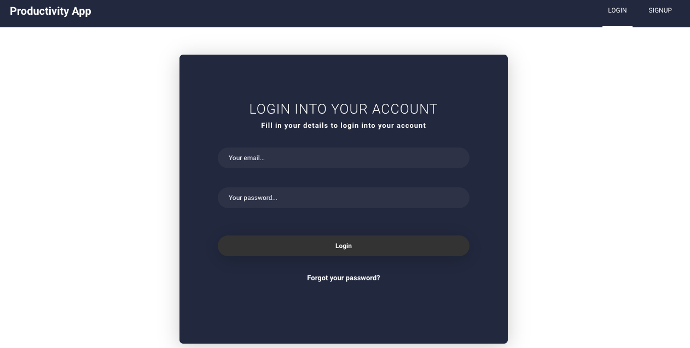

# Productivity App

## `Accomplish what’s meaningful to you each day!`



**Anywhere you are**<br>
Quickly capture and retrieve your lists and tasks across devices to help you stay organized at work, home, or on the go. 

**Smart daily planning**<br>
If you're looking for a tool that'll simply help you build good habits and encourage you to cross things off your to-do list, Productivity app is a good option for you. Get a better idea of how it works in this video: [HERE!](https://drive.google.com/open?id=183neDgc_ltHjbHAzDLZat9N0qu6OaT84) 

### DEMO THE APP HERE [CLICK ME!](https://tracker-2152.web.app)

___
___

In the project terminal you can run:

```bash
npm start
```
Runs the app in the development mode.<br>
Open [http://localhost:3000](http://localhost:3000) to view it in the browser.

The page will reload if you make edits.<br>
You will also see any lint errors in the console.

### Technologies used
* React       
* Redux
* Firebase 
* Formik
* Yup


